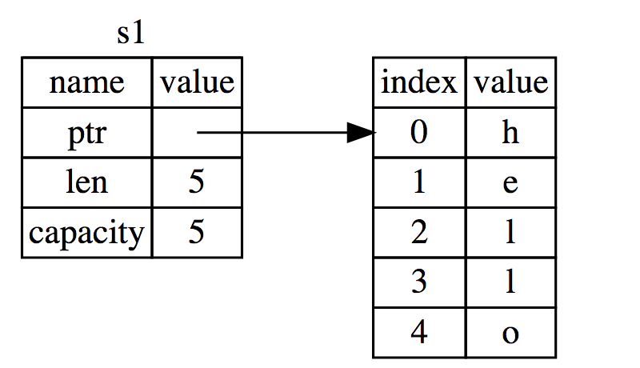
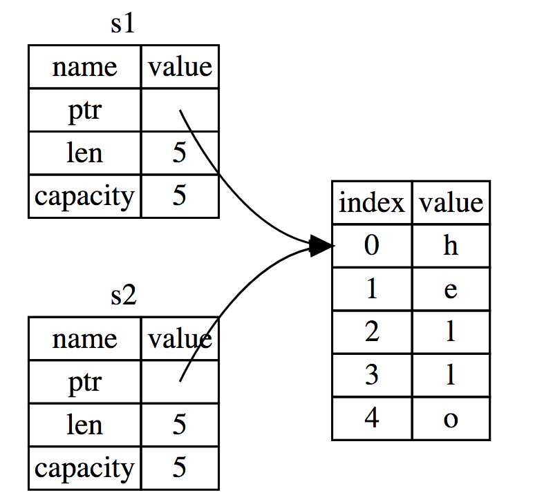
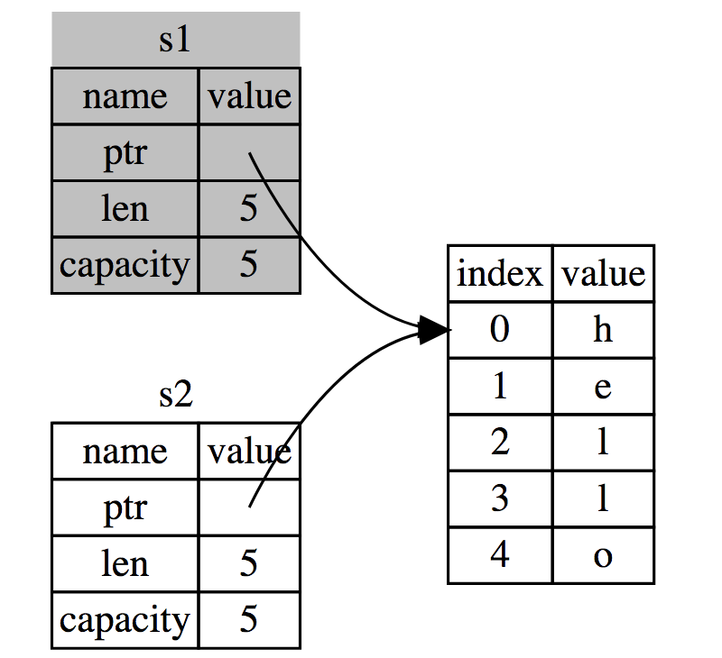
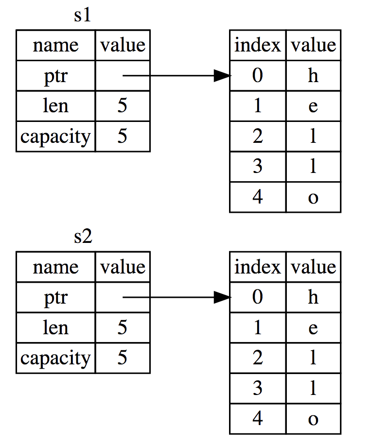
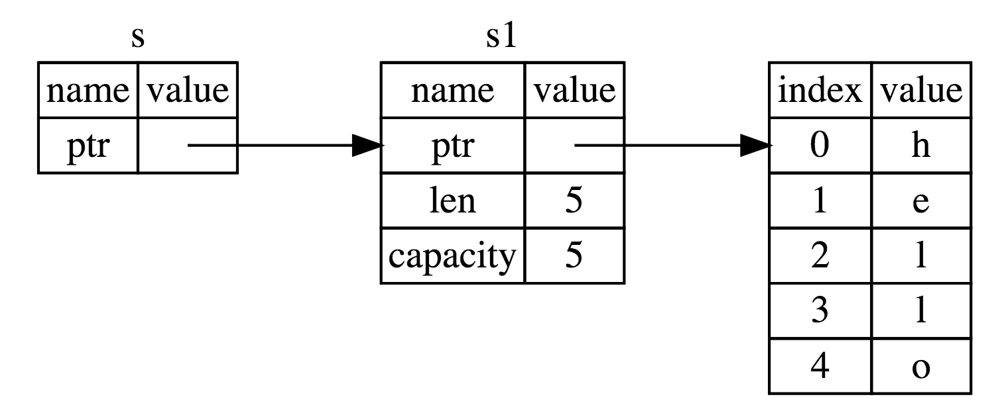

### 规则
* Rust 中的每一个值都有一个被称为其 所有者（owner）的变量。
* 值有且只有一个所有者。
* 当所有者（变量）离开作用域，这个值将被丢弃。(Rust 在结尾的 }处自动调用 drop释放内存)
* 移动（堆内存变量），当值(s1)被赋值给另外一个变量(s2)后，rust则认为变量s1，不再有效。
* 栈类型变量无移动的说法（没有深浅拷贝的区别）
* 将值传递给函数在语义上与给变量赋值相似
* 利用引用让变量不被函数参数move

### 变量与数据的交互（move）
* 将 5 绑定到 x；接着生成一个值 x 的拷贝并绑定到 y。现在有了两个变量，x 和 y，都等于 5。因为正数是有已知固定大小的简单值，所以这两个 5 被放入了栈中（重点：两个值都放入栈中了）。
    ``` rust
    let x = 5;
    let y = x;
    ```
* s1 和 s2 这两个变量指向相同的地址（hello分配的堆内存）。
    ```
    let s1 = String::from("hello");
    let s2 = s1;
    ```
* 图1-1（s1 的内存引用图）
 
* 图1-2（s1和s2的引用图（错误）其他语言js\go 是这样的）

* 图1-3（s1和s2的引用图（正确）rust 是这样的，s1赋值s2后,Rust 则认为 s1 不再有效）

### 当值(s1)被赋值给另外一个变量(s2)后，rust则认为变量s1，不再有效（图1-3）
* Rust 在结尾的 }（作用域结束后） 处自动调用 drop（释放内存）。
* 如上图，当 s2 和 s1 离开作用域，他们都会尝试释放相同的内存。这是一个叫做 二次释放（是错误的）。
* 为了确保内存安全，Rust 则认为 s1 不再有效，因此 Rust 不需要在 s1 离开作用域后清理任何东西，如下案例。
    ``` rust
    fn main() {
        let s1 = String::from("hello");
        let s2 = s1;

        // 本行会报错 value borrowed here after move
        println!("{}, world!", s1);
    }
    ```
### 克隆（深拷贝）
* 实现如下图，赋值变量的同时，进行数据拷贝的方案，rust也是支持的
* 这段代码能正常运行,产生的变量内存如图1-4
    ``` rust
    fn main() {
        let s1 = String::from("hello");
        let s2 = s1.clone();

        println!("s1 = {}, s2 = {}", s1, s2);
    } 
    ```
* 图1-4 
      

### 栈类型变量无移动的说法(纯拷贝)
* x,y是编译时确定大小的类型，因此整个存储在栈上，所以拷贝其实际的值是快速的。因此rust对栈变量进行纯拷贝，便不会造成性能的影响。
* 也就意味着创建变量 y 后， 没必要使x 无效。
``` rust
let x = 5;
let y = x;

println!("x = {}, y = {}", x, y);
// x = 5, y = 5
```

### 将值传递给函数在语义上与给变量赋值相似
``` rust
fn main() {
    let s = String::from("hello");  // s 进入作用域

    run_move(s);                    // s 的值移动到函数里,s失效
                                    // 因此到这里，s不再有效
    /* 
    将会报错：因为s已经被move
    报错信息：will error value borrowed here after move
    println!("s:{}",s);            
    */
    let x = 5;                      // x 进入作用域

    run_copy(x);                    // x 应该移动函数里
    println!("x:{}",x);             // 因为 x 是 栈变量，因为不会被 move 使失效
} 
//  x 移出了作用域，
//  s 移出了作用域但,因为 s 的值已被移走，所以不会有特殊操作

fn run_move(some_string: String) { // some_string 进入作用域
    println!("run_move:{}", some_string);
} // 这里，some_string 移出作用域并调用 `drop` 方法。占用的内存被释放

fn run_copy(some_integer: i32) { // some_integer 进入作用域
    println!("run_copy:{}", some_integer);
} // some_integer 移出作用域

```
### 利用引用让变量不被函数参数move
* 引用它允许你使用值但不获取其所有权
* 当引用离开作用域后并不丢弃它指向的数据
    ``` rust

    fn main() {
        let s1 = String::from("world"); // s1 进入作用域
        run_not_move(&s1);              // 传递说s1的引用作为参数
        println!("s2:{}",s1);           // 正常打印

       // &s1.push_str("push"); //cannot borrow as mutable 
       
       /* 这样也不行
       let mut mys1  = &s1;
       mys1.push_str("push");
       */
    }

    fn run_not_move(s: &String){ //s 是指向说s1的引用，不会触发move
        println!("run_not_move:{}", s);
        //s.push_str(",okok"); # 1-1：执行本操作报错：`s` is a `&` reference, so the data it refers to cannot be borrowed as mutable
    }// 变量s离开作用域
    ```
* 如图1-5,引用s指向是s1,但不拥有它的值,因此我们可以正常打印出s1的值
* 因此我们称呼s为借用，&s1为引用
* 借用只可读,不允许通过借用去修改借来的值(如代码1-1处)


### 可变引用
* 在特定作用域中的特定数据有且只有一个可变引用
* 不能在拥有不可变引用的同时拥有可变引用
``` rust
fn main() {
    let mut s = String::from("hello");
    change(&mut s);
}

fn change(some_string: &mut String) {
    some_string.push_str(", world");
}
```
[测代码](./owership/src/main.rs)